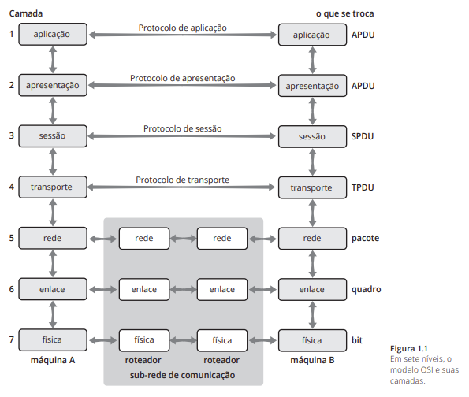
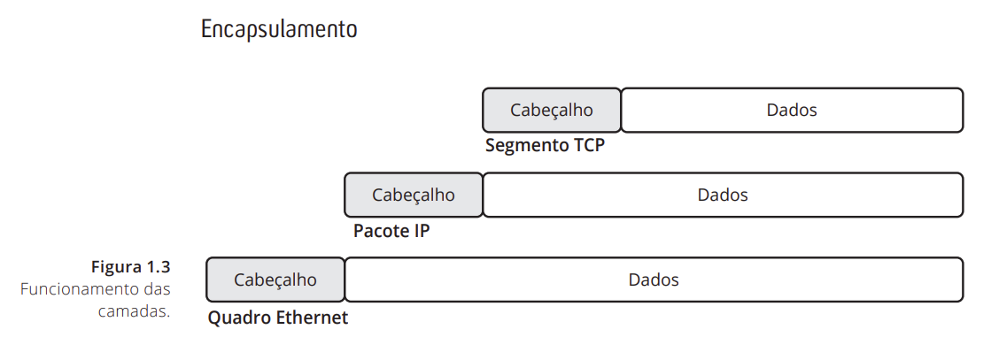
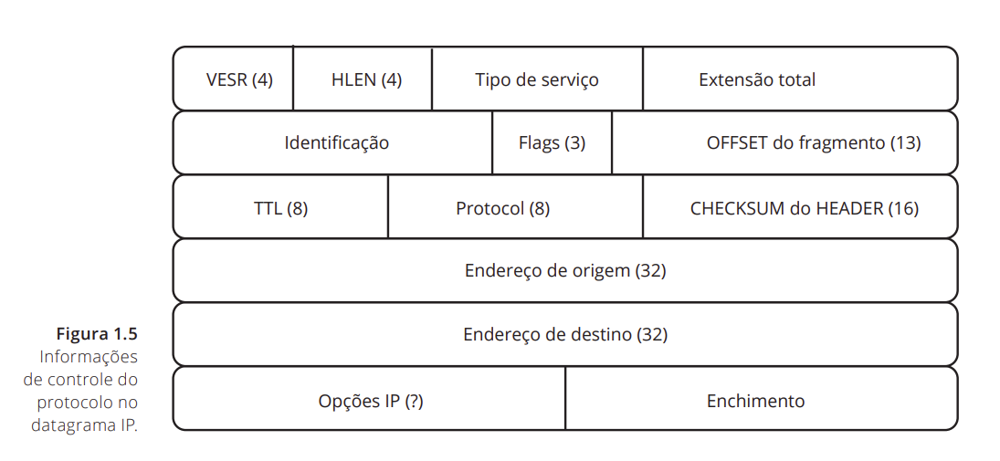
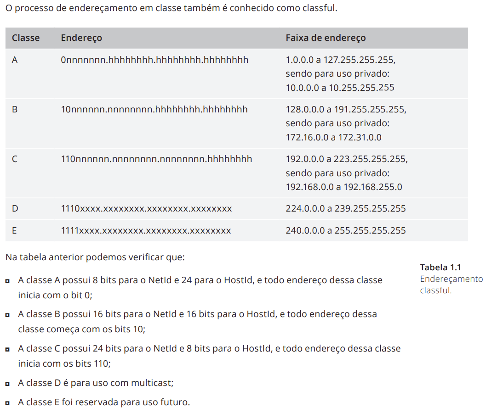

## Sumário
- [Introdução à administração de redes e arquitetura TCP/IP (parte 1)](#cap1)

<h2 id="cap1">Introdução à administração de redes e arquitetura TCP/IP (parte 1)</h2>

### Modelos de Rede
- **Conceito de camadas**
  - São responsaveis por prover conectividade ao computador e rotear caminhos para que os pacotes de dados possam trafegar entre fonte e destino;
  - Nenhuma camada oferece os serviços suportados por outra camada;
  - Cada camada possui uma forma de identificação (endereçamento) de seus próprios dados que, por sua vez, encapsulam dados das camadas superiores.
  - Cada camada recebe e envia requisições à camada imediatamente superior ou inferior e se comunica com a mesma camada em outro host.

#### Modelo ISO/OSI (Open Systems Interconnection)

#### Modelo TCP/IP

- **Tipos de camada**
  - Física: transforma bits em sinais elétricos, ópticos e ondas de rádio.
    - estabelece o canal de comunicação das máquinas com base no meio de transmissão (cabo coaxial, par trançado, fibra ótica, etc.). 
    - para fins de aprendizado, pode-se considerar que essa camada é constituída pela placa de rede, que transforma o sinal lógico em elétrico, pelo cabo de rede e pelos conectores das máquinas;
    - transforma um sinal físico e o passa para o nível 2 como um sinal lógico, interpretado de acordo com seus protocolos, sem se preocupar com o seu conteúdo.

  - Enlace: agrupa os bits recebidos da camada física em quadros de dados.
    - se identifica como destino do quadro recebido e verifica se ele está livre de erros;
    - extrai suas informações de controle e envia os dados para a camada superior;
    - implementa mecanismos de identificação de dos quadros de dados, mecanismos de endereçamento, protocolos para acessar o meio e protocolos para detectar e opcionalmente corrigir erros de quadros.
   
  - Rede: define e encaminha a unidade básica de transferência (datagrama).
    - define e roteia de datagramas (unidade básica de transferência de rede) entre máquinas que podem estar conectadas em redes físicas distintas;
    - o roteamento é baseado em mecanismos de endereçamento globais que identificam cada máquina da rede de forma única;
    - uma vez que os pacotes trafegam através de redes com diferentes capacidades de transmissão, esse nível também pode implementar mecanismos de controle de congestionamento.
   
  - Transporte: assegura que pacotes enviados serão recebidos.
    - pode implementar mecanismos de controle de sequência e de controle de erro que asseguram que os dados serão entregues na ordem correta, sem duplicações e erros;
    - pode implementar um controle de fluxo para equilibrar as capacidades de processamento das máquinas-origem e destino;
    - fornece conectividade fim-a-fim, o que isola as camadas superiores dos aspectos de transmissão de dados.
   
  - Sessão: provê mecanismos para lidar com funcionalidades necessárias à aplicação.
    - pode implementar controles de diálogo entre os sistemas;
    - pode implementar mecanismos de recuperação de falhas que permitem a retomada de transferências de dados do ponto onde foram interrompidas.
   
  - Apresentação: faz o tratamento de dados.
    - realiza transformações nos dados relativas à compressão de textos, criptografia e conversão de formatos de representação;
    - se essa camada existisse no TCP/IP, a conversão de acentos e de números não precisaria ser executada através dos navegadores web;
   
  - Aplicação: dados gerados pela aplicação-origem e requisitados e/ou recebidos pela aplicação-destino.
    - dados finais são essencialmente aqueles gerados pela aplicação-origem e requisitados e/ou recebidos pela aplicação-destino;
    - pertencem a esse nível as aplicações de propósitos gerais, como transferência de arquivos, correio eletrônico e terminal remoto.
  
- **Funcionameto/relacionamento das camadas**

  - Cada camada possui uma forma de identificação e/ou endereçamento, e cada uma delas encapsula dados das camadas superiores.
  - Os dados que trafegam pelas camadas são organizados em pacotes, cada um contém um cabeçalho (header) e uma área de dados.
    - esse modelo permite que um pacote de uma determinada camada seja transportado por diferentes protocolos da camada inferior.
    - imagine um pacote IP com origem na máquina A, ligada em uma rede Ethernet, com destino à máquina B:
      - Máquina A: encapsularia o pacote IP em um quadro Ethernet e o transmitiria para um roteador (com interfaces nas duas redes);
      - Roteador: extrairia o pacote IP do quadro Ethernet, o encapsularia em um quadro e o transmitiria para a máquina B;
      - Máquina B: extrairia o pacote IP do quadro e o processaria.
      
- **Quadro Ethernet**
  - Possui um sistema de endereçamento de 48 bits.
  - Conhecido como endereço físico (MAC) e está associado ao dispositivo de interface de rede.
  - Os endereços físicos podem ser de três tipos:
    - unicast (interface única); 
    - multicast (um grupo); 
    - broadcast (todos os computadores na rede).
    
  - Seu formato é composto por:
  
  
    - Preâmbulo: serve para sincronizar os relógios do receptor e do transmissor.
      - não é considerado para efeito de cálculo do tamanho do quadro.
      
  - Utilizado na tecnologia Ethernet, o CSMA/CD possui um método para detectar colisão, ou seja, além de verificar se o canal está ocupado no instante da transmissão,também avisa se uma colisão ocorrer durante o tempo de acesso ao meio.
  - Quando duas máquinas na mesma rede local querem se comunicar, elas precisam primeiro descobrir o endereço físico do receptor. Para isso é utilizado o protocolo Address Resolution Protocol (ARP).
  
- **Protocolo IP**
  - Não é confiável: não implementa mecanismos de confirmação de fluxo de dados;
  - Não é orientado à conexão: não existe um mecanismo que indique a (des)ordem de recebimento dos pacotes referente ao seu envio.
  
- **Datagrama IP**

  - VERS: versão;
  - HLEN: comprimento do cabeçalho;
  - Tipo de serviço: qualidade do serviço (prioridade, retardo, vazão e confiabilidade);
  - Flags: 
    - DF – 1 bit indicando pedido para não fragmentar;
    - MF – 1 bit indicando se existem ainda outros fragmentos.
  - Offset do fragmento: posição do fragmento com relação ao datagrama original;
  - Tempo de Vida (TTL): evita que pacotes fiquem circulando indefinidamente na rede, por em loop ou outro motivo.
  - Checagem do cabeçalho: mecanismo utilizado para detectar erros no cabeçalho;
  - Enchimento: usado para fazer um enchimento quando as opções não são múltiplas de 32 bits (MTU e fragmentação);

- **Endereçamento IP**
  - O protocolo IP é responsável pelo endereçamento e roteamento dos pacotes. 
  - O protocolo IP foi definido em classes A, B, C, D e E, que definem diferentes quantidades de bits para o endereço IP.
    - no TCP/IP, o endereço recebe o nome de endereço IP e é constituído por 32 bits.
 

    
  - O endereço IP está associado ao nível de rede. 
  - O nível IP define uma associação entre um endereço IP e um endereço físico. 
    - um determinado endereço IP pode ser associado somente a um único endereço físico (feita pelo protocolo ARP).
  - Cada endereço pode ser dividido em duas partes: 
    - NetId: conjunto dos bits que representa o endereço da rede. 
    - HostId: conjunto dos bits que representa a máquina dentro da rede.
    - nnnnnnnn.nnnnnnnn.nnnnnnnn.hhhhhhhh = nnn.nnn.nnn.hhh
  -  Todas as máquinas de uma determinada rede compartilham um prefixo nos seus endereços IP denominado endereço de rede.
    - Os endereços IP 192.168.0.10, 192.168.0.30 e 192.168.0.50 pertencem a máquinas da mesma rede 192.168.0.0.
    
   
  
