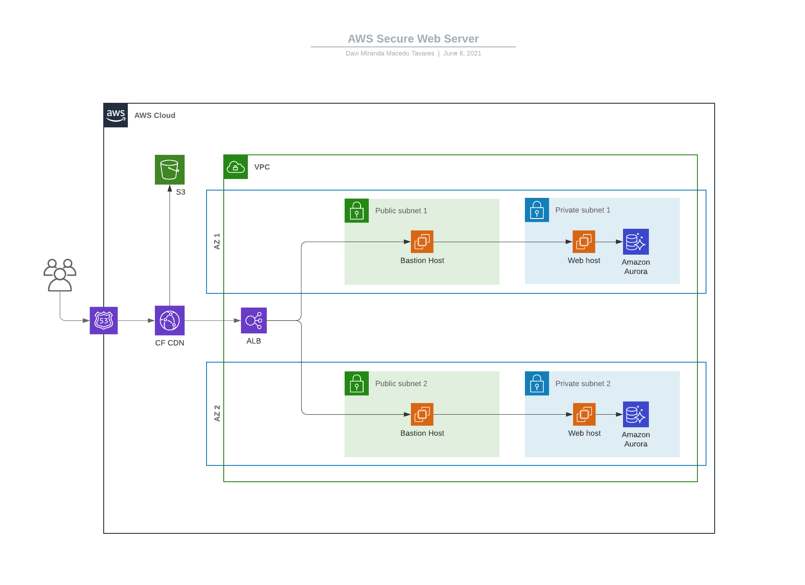

## Topologia


## Passo-a-passo
1. Criar VPC
   - Adicionar CIDRs necessários
1. Criar IG; alocar na VPC; adicionar na Route Table
1. Criar public subnet e private subnet
1. Criar EC2 (web server) dentro da private subnet
   - Bootstrap:
        ```
        #!/bin/bash
        yum update -y
        yum install httpd -y
        systemctl start httpd
        systemctl enable httpd
        echo "dataRain" > /var/www/html/index.html
        ```
        - Para usar PHP:
          ```
          yum install amazon-linux-extras -y
          amazon-linux-extras enable php8.0
          yum clean metadata
          yum install -y php php-pear
          yum install php-{cgi,curl,mbstring,gd,mysqlnd,gettext,json,xml,fpm,intl,zip}
          sed -i 's/DirectoryIndex index.html/DirectoryIndex index.php index.html/' /etc/httpd/conf/httpd.conf
          echo '<?php echo "X-Forwarded-For: " .  $_SERVER["HTTP_X_FORWARDED_FOR"]; echo "<br>Client IP: " .  $_SERVER["HTTP_CLIENT_IP"]; echo "<br>HTTP Host: " .  $_SERVER["HTTP_HOST"]; echo "<br>Server Name: " . $_SERVER["SERVER_NAME"]; echo "<br>Remote Address: " . $_SERVER["REMOTE_ADDR"]; echo "<br>Server Address: " . $_SERVER["SERVER_ADDR"]; ?>' > /var/www/html/index.php
          systemctl restart httpd
          ```
          - Para saber a versão mais recente do php: ```amazon-linux-extras | grep php```
    - Chek output: ```/var/log/cloud-init-output.log```
1. Criar EC2 (proxy server) dentro da public subnet
    - Bootstrap:
        ```
        #!/bin/bash
        yum update -y
        yum install firewalld -y
        systemctl start firewalld
        systemctl enable firewalld
        firewall-cmd --permanent --new-zone=web-server-01
        firewall-cmd --reload
        firewall-cmd --set-default-zone=web-server-01
        firewall-cmd --reload
        firewall-cmd --permanent --add-port=443/tcp
        firewall-cmd --permanent --add-port=80/tcp
        firewall-cmd --permanent --add-port=22/tcp
        firewall-cmd --permanent --add-service=https
        firewall-cmd --permanent --add-service=http
        firewall-cmd --permanent --add-service=ssh
        firewall-cmd --permanent --add-masquerade
        firewall-cmd --permanent --add-source=<ec2_web_server_1_ip/mask>
        firewall-cmd --permanent --add-forward-port=port=80:proto=tcp:toport=80:toaddr=<ec2_web_server_1_ip>
        firewall-cmd --permanent --add-forward-port=port=443:proto=tcp:toport=443:toaddr=<ec2_web_server_1_ip>
        firewall-cmd --reload
        ```
    - Caso o firewalld dê algum problema na porta 80: ```iptables -A INPUT -p tcp --dport 80 -m conntrack --ctstate NEW,ESTABLISHED -j ACCEPT```
1. Criar security group bastion-host
    - SSH <your_ip/mask>
1. Criar security group proxy-server
    - SSH <bastion_host_ip/mask>
    - HTTP ALL
1. Criar security group private-web-server
    - SSH <bastion_host_ip/mask>
    - HTTP <proxy_server_ip/mask>
1. Criar NACL private-subnet
    - INPUT
        - SSH <bastion_host_ip/mask> ALLOW
        - HTTP <proxy_server_ip/mask> ALLOW
        - HTTPS <proxy_server_ip/mask> ALLOW
        - \* All DENY
    - OUTPUT
      - Custom TCP 32768 - 65535 <bastion_host_ip/mask> ALLOW
      - Custom TCP 32768 - 65535 <proxy_server_ip/mask> ALLOW
      - \* All DENY

1. Após configurar o R53, pode-se fazer o redirecionamento da requisição na porta 80 para a 443 dentro do ALB, ou também pelo Proxy Server:
  - firewall-cmd --permanent --add-forward-port=port=80:proto=tcp:toport=443:toaddr=<ec2_web_server_1_ip>