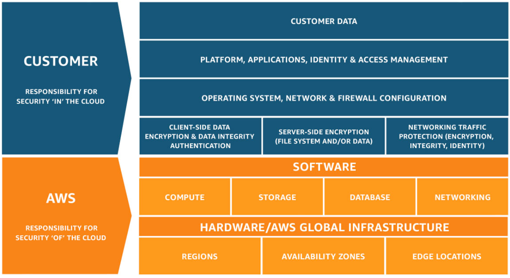

# AWS Cloud Practitioner Exam Overview

### Define the AWS Cloud and its value proposition:
 - A secure cloud service that provides computing, networking, storaging and various services. 
 - It proposes Agility, Elasticity, Flexibility and Security.

### Define the Advantages of Cloud Computing:
 - Trade capital expense for variable expense
 - Massive economies of scale
 - Stop guessing capacity
 - Speed and agility
 - Stop spending money running and maintaining data centers
 - Go global in minutes

### List the different well-architected framework design principles:
  - **Operational excellence:**
    - Perform operations as code
    - Make frequent, small, reversible changes
    - Refine operations procedures frequently
    - Anticipate faillure
    - Learn from all operational failures

  - **Security:**
    - Implement a strong identity foundation
    - Enable traceability
    - Apply security at all layers
    - Automate security best practices
    - Protect data in transit and at rest
    - Keep people away from data
    - Prepare for security events

  - **Reliability:**
    - Automatically recover from failure
    - Test recovery procedures
    - Scale horizontally to increase aggregate workload availability
    - Stop guessing capacity
    - Manage change in automation

  - **Performance Efficiency:**
    - Selecting the right resource types and sizes based on workload requirements
    - Monitoring performance
    - Making informed decisions to maintain efficiency as business needs evolve

  - **Cost Optimization:**
    - Eliminate unneeded cost or suboptimal resources
    - Understanding and controlling where money is being spent
    - Selecting the most appropriate and right number of resource types, analyzing spend over time
    - Scaling to meet business needs without overspending

---

## Main Technologies

### Analytics
 - **Athena**: Query Data in S3 using SQL
 - **EMR**: Simplifies running big data frameworks (Apache Hadoop)
 - **Compute Optimizer**: Analyzes (machine learning) metrics of utilization and makes recommendations

### Cost Management
 - **Cost Explorer**: Analyze Your AWS Cost and Usage, provides usage-based forecasts of estimated billing for the next month
 - **Budgets**: Set Custom Cost and Usage Budgets (alerts)
 - **Cost and Usage Report**: Access Granular Comprehensive Cost and Usage Information, tracks your usage and provides estimated charges (without usage-based forecasts)
 - **Bills**: List the Historical Cost that would have been ocurried over the past month
 - **Savings Plans**: Save up to 72% on compute usage with flexible pricing
 - **Pricing Calculator**: create an estimate for the cost of your use cases

### Compute
 - **Elastic Container Registry**: Store and Retrieve Docker Images
 - **Elastic Container Service**: Run and Manage Docker Containers, simple API
 - **Lightsail**: Non-tech Launch and Manage Virtual Private Servers, saving doest not apply
 - **Elastic Beanstalk**: Run and Manage Web Apps (.NET, Node, Python)
 - **Fargate**: Run Containers without Managing Servers or Clusters, serverless
 - **Outposts**: Run AWS services on-premises

### Database
 - **Aurora**: High Performance fully-managed Relational Database
 - **DynamoDB**: fully-managed serverless NoSQL Database
  - **Redshift**: Fast, Simple, Cost-effective Data Warehousing, BI Tools, optimized for analysis and reporting of large amounts of data
 - **DocumentDB**: fully-managed document database
 - **ElastiCache**: In-memory Caching System
 - **RDS**: Managed Relational Database Service for MySQL, PostgreSQL, Oracle, SQL Server, and MariaDB
 - **RDS on VMware**: Automate on-premises database management
 - **Database Migration Service**: Migrate Databases with Minimal Downtime
 - **Schema Conversion Tool**: Makes heterogeneous database migrations by automatically converting the source database schema

### Developer Tools
 - **Cloud9**: IDE, Write, Run, and Debug Code
 - **CodeBuild**: Build and Test Code, fully managed continuous integration service that compiles source code
 - **CodeCommit**: Store Code in Private Git Repositories
 - **CodeDeploy**: Automate Code Deployment
 - **CodePipeline**: Release Software using Continuous Delivery, automate BTD
 - **CodeStar**: Develop and Deploy Applications, unified interface
 - **X-Ray**: Analyze and debug your applications
 - **CodeGuru**: Provides intelligent recommendations for improving code quality (machine learning)

### Management
 - **CloudWatch**: Monitor Resources and Applications metrics
 - **CloudFormation**: Create and Manage Resources with Templates
 - **CloudTrail**: Track User Activity and API Usage, enables governance, compliance and risk auditing
 - **Config**: Track Resource Inventory and Changes
 - **OpsWorks**: Automate Operations (replication and deployment) with Chef and Puppet
 - **Organizations**: Central governance and management across accounts
 - **Personal Health Dashboard**: Personalized View of Services Health
 - **Service Health Dashboard**: Up-to-minute health info
 - **Service Catalog**: Create and Use Standardized Products (IAM, CloudFormation)
 - **Trusted Advisor**: Optimize Performance and Security, check service limits and provide guidance to provision resources (P,CO,S,FT,SL)
 - **Well-Architected Tool**: Review and improve your workloads

### Networking and Content Delivery
 - **CloudFront**: Global Content Delivery Network
 - **Route 53**: Scalable Domain Name System
 - **Global Accelerator**: Improve application availability and performance
 - **Transit Gateway**: Easily scale VPC and account connections
 - **Elastic Load Balancing**: Distribute incoming traffic across multiple targets

### Security and Compliance
 - **IAM**: Manage User Access and Encryption Keys
 - **Cognito**: Identity Management for your Apps (mobile, web)
 - **Detective**: Investigate potential security issues, machine learning
 - **GuardDuty**: Managed Threat Detection Service, continuously monitors for malicious activity (accounts, workloads, and data stored in S3)
 - **Inspector**: Analyze Application Security (create assessment template)
 - **Macie**: Discover, Classify, and Protect your Data (machine learning)
 - **CloudHSM**: Hardware-based Key Storage for Regulatory Compliance
 - **Key Management Service**: Managed Creation and Control of Encryption Keys
 - **RAM**: Simple, secure service to share AWS resources (accross regions)
 - **Security Hub**: Unified security and compliance center, automate continuos security checks of your high-priority 
 - **Shield**: DDoS Protection
 - **WAF**: Filter Malicious Web Traffic
 - **Secrets Manager**: Stores encrypted credentials and eliminates the need for hard-coding credentials
 - **Encryption SDK**: Encryption client-side library, do not require AWS

### Storage
 - **Elastic File System (EFS)**: Fully managed file system for EC2
 - **Storage Gateway**: Hybrid Storage Integration
 - **CloudEndure Disaster Recovery**: Highly automated disaster recovery
 - **QuickSight**: Fast Business Analytics Service
 - **Simple Notification Service (SNS)**: Pub/Sub, Mobile Push and SMS
 - **Simple Queue Service (SQS)**: Managed Message Queues, helps decoupling app components

---

## AWS Shared Responsability Model

